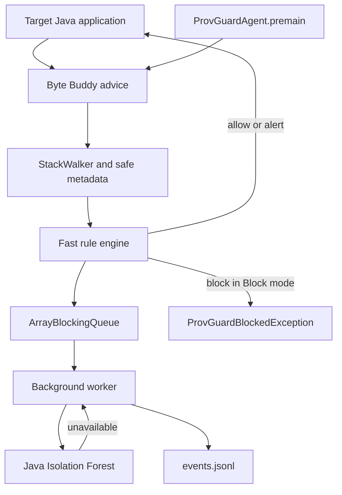

# Architecture

ProvGuard is a Java agent. The fast path runs on the application thread and can block only a confirmed rule match. Detailed logging and anomaly scoring run on one background worker.

The three instrumented methods are `Runtime.exec`, `ProcessBuilder.start`, and `ObjectInputStream.resolveClass`. A stack trace from `StackWalker` is a call-path trace. It is not a provenance graph and it is not taint tracking.
