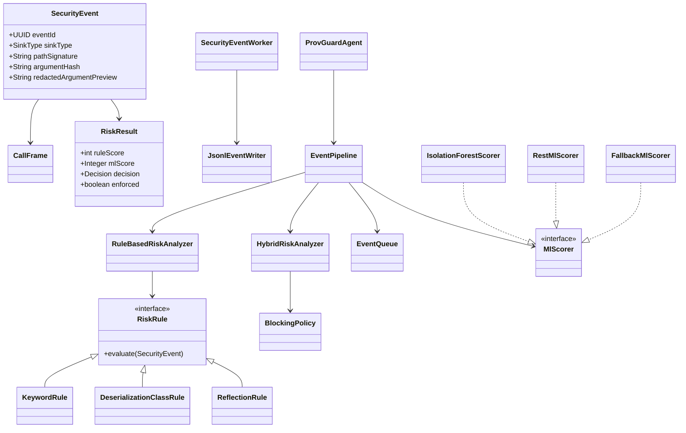

# Class diagram

`KeywordRule`, `DeserializationClassRule`, and `ReflectionRule` stand in for the full rule set in `provguard-rules`. Each rule returns a score delta. `BlockingPolicy` is the only place that turns those scores into allow, alert, or block.
