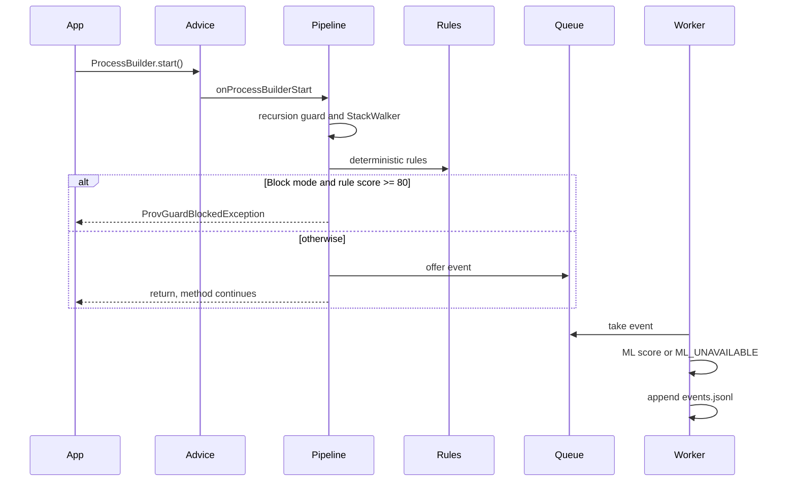

# Sequence: monitored process start

```mermaid
sequenceDiagram
    participant App
    participant Advice
    participant Pipeline
    participant Rules
    participant Queue
    participant Worker

    App->>Advice: ProcessBuilder.start()
    Advice->>Pipeline: onProcessBuilderStart
    Pipeline->>Pipeline: recursion guard and StackWalker
    Pipeline->>Rules: deterministic rules
    alt Block mode and rule score >= 80
        Pipeline-->>App: ProvGuardBlockedException
    else otherwise
        Pipeline->>Queue: offer event
        Pipeline-->>App: return, method continues
    end
    Worker->>Queue: take event
    Worker->>Worker: ML score or ML_UNAVAILABLE
    Worker->>Worker: append events.jsonl
```

The background worker never throws `ProvGuardBlockedException`. If the queue is full, the event is dropped and the application continues.
